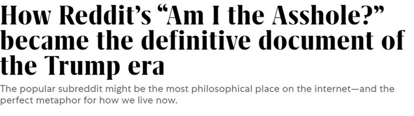
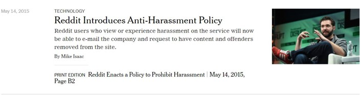
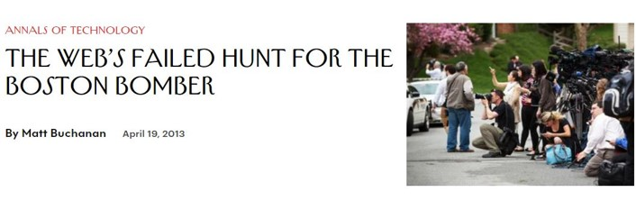
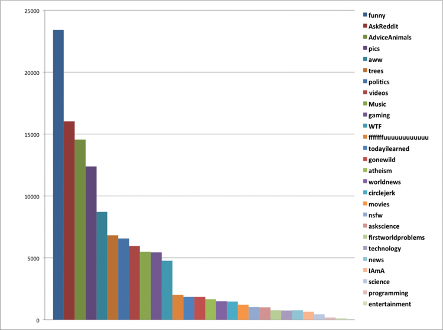
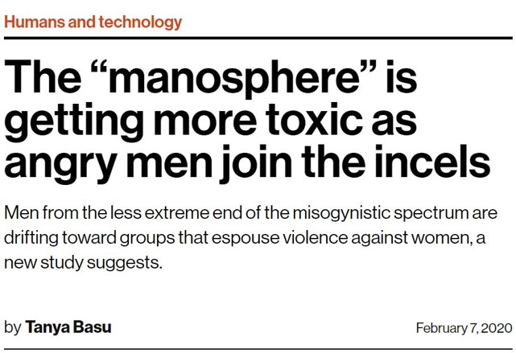
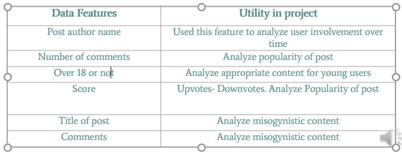
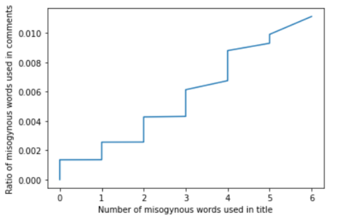
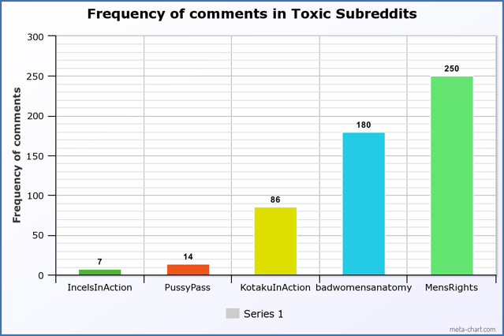

# Identifying Misogynistic Rhetoric Within Advice-Seeking Communities

**Reddit in Popular Culture:**

Reddit has been consistently among the top ten most frequented websites for the last few years. Posts from the website often make way from the front page to mainstream media. Its anonymity helps users engage in discourse freely.

  
  
  

**Why should anybody care?**

Advice subreddits have been increasing in activity and often make their way to the front page. With anonymity assured, users are free to influence hate speech. For the original advice seeker, either they may be turned off from Reddit as a platform, or may choose to believe negative discourse.

**Baseline Approach and Description**

The approach used by Farrell et al. in their paper, Exploring Misogyny across the Manosphere in Reddit, was used as a baseline for this project. Communities selected identified with men’s rights activism and incel idealism. To characterize the misogyny they built 9 lexicons for the different levels of hate speech. These constructed lexicons were used to calculate the amount of misogynistic posts per community, the amount of users posting such content per community, the top terms in each community, and the evolution over time of these communities for the different levels of misogyny. 

**Project Approach**

The communities analyzed by the baseline work were already infamous for their ideologies. We aim to analyze advice- seeking communities and monitor spread of hate speech and toxic ideologies within these communities. ‘Community Interaction and Conflict on the Web’ by Kumar et. al showed that users engagement drops when they start facing negativity in certain communities. We seek to verify this within selected Reddit communities.

**Novelty**

- We seek to explore the effect of hate speech within the advice seeking community
- The baseline approach performed the following analysis: 
    - Analyzing the most frequent misogynous words
    - Finding the percentage of misogynous posts
    - Finding the frequency of misogynous words used over time
- We introduce 4 new avenues of analysis: 
    - Analysis of negativity for over 18 and under 18 users
    - Relation between negativity in title and comments
    - Whether unpopular posts receive more negativity 
    - Where do the users with negative submissions post most frequently in

**Data Acquisition**

- Data from following Reddit communities were acquired: AskReddit, relationships, relationship_advice, AmITheAsshole and OffMyChest.
- Used a Reddit Search Application, Pushshift.io, to mine the posts from five subreddits and chose the top 1000
- Mined comments under posts using Reddit’s API The Python Reddit Wrapper(PRAW)

**Data Properties**

Features of data used in this project:  

**Experimental Setup**

Lexicon of Misogynistic words had a selection from these categories:  Belittling, Flipping the narrative, homophobia, hostility, patriarchy, physical violence, racism, sexual violence and stoicism.

The analysis was done on Google Colaboratory and Kaggle
    - Runtime Type: Python3
    - Hardware Accelerator: GPU
    - RAM: 12 GB  

**Data Analysis Approach**

For the sake of simplicity, data analysis of one Reddit community has been presented here.
Reddit community information::
Community:  AskReddit
Date range: 2008-02-08 to 2009-01-24
Number of posts: 1000
Avg number of comments per post: 137

**Data Analysis and Results**

Misogynist words were detected in the comments section. Their frequencies were plotted over time as seen in the figure below. This was done for each community, and for each category of misogyny from the lexicon.

It's observed that there is a growing trend over the year. It could be due to more user engagement in the Christmas holiday season. It's interesting to note that words associated with Physical Violence and Hostility see a steady growth.

- Found the percentage of misogynous posts for each category of misogyny. 
- A misogynous post has a comments section that contains any misogynistic words found in the lexicon.
- User most  likely to come across references to  Physical Violence (80%) , Hostility (78%) , Belittling (48%) and Racism (47%).   

- Found the top misogynous words and their frequencies used across all categories.
- Most frequently used words include Hate, Hit, Cut, Kill etc.
- These words point to some violent attitudes in the comments section of a community that elicits further hateful discussions.
- Top 5 words from some popular categories are given below  

- Found correlation between frequency of misogynistic words in the title of post and comments section of post
- Found a linear relation
- Questions asked in relation to misogynous content invited more misogynous discussions in the comments section  

- High number of comments and low score shows that the post received a lot of downvotes. 
- Posts having lesser score than the number of comments generally have a high percentage of misogynous words (0.2% - 0.5%)in the comments section  

- Number of misogynous words found in posts for users above 18  and under 18 was plotted
- For AskReddit community, underage users were exposed to less hostile comments as compared to users above 18  

- So what communities do the users engaging in negative discourse contribute the most to?
- These communities have been on Southern Poverty Law Center’s hatewatch  

**Baseline Result Comparison**  

Baseline Results:  

  

Our Results:  

  

**Future Work**

Due to time restrictions, we could only perform the analysis on 5 subreddits. The work can be extended to other subreddits to gain a larger dataset.
Additionally, more in-depth analysis can be made to identify a trend in the content projected by a given user to spot possibilities of severe problems.
Algorithms using the concepts of Machine Learning and Deep Learning can be incorporated to train a model on the dataset to alert moderators quicker, or indicate to the user how seriously to take advice espoused by fellow Redditors.

